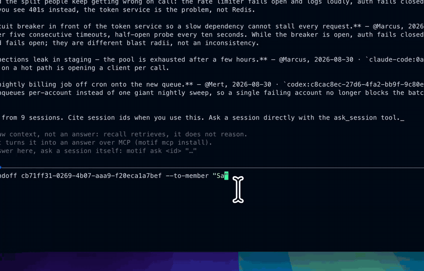
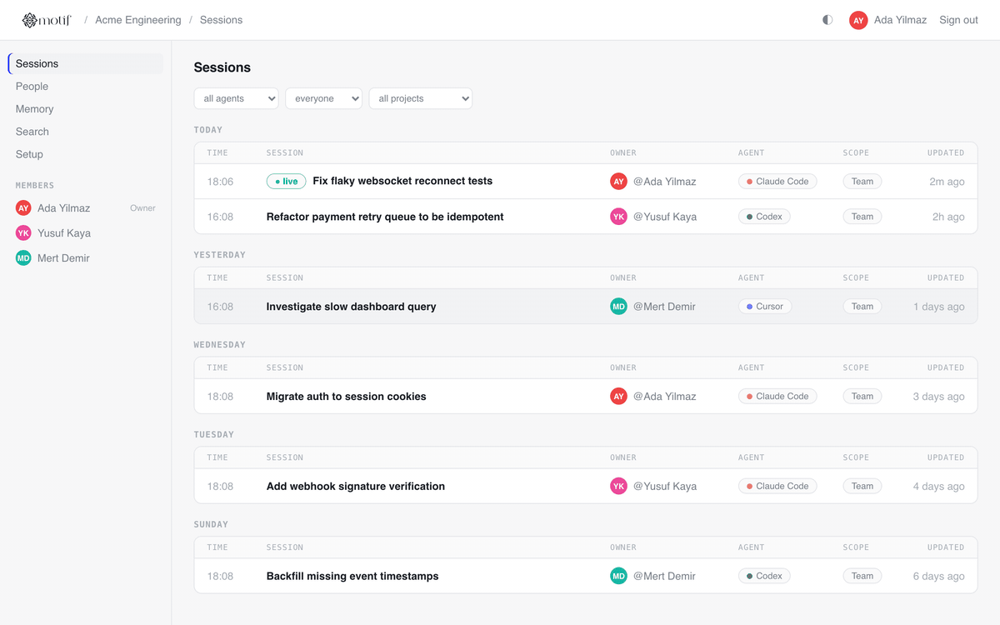

# Motif

**A unification layer for AI coding agent sessions.** Open source, fully self-hosted.

<p align="center">
  
</p>

<p align="center"><i>Start in Claude Code, finish in Codex — the session comes with you, natively.</i></p>

Your team writes code with Claude Code, Codex, and Cursor — each tool keeps its sessions
in its own format, in its own corner. Motif collects them in one place, makes them
searchable across tools and teammates, streams them live to a team dashboard, and can
hand a session started in one tool over to another tool **natively** — the target tool
treats it as its own history, not a summary.

## Features (v1)

- **Collect** — a lightweight daemon watches **Claude Code, Codex, and Cursor**
  sessions on each dev machine and syncs them live to your self-hosted server.
  Sessions never leave your infrastructure. (Agents running open-weight models
  through OpenCode/Aider-style tools are on the roadmap; open-weight models
  themselves — Hermes, Qwen, Llama via Ollama/OpenRouter — already work today
  as the memory engine through the `openai-compatible` provider.)
- **Native handoff** — convert a Claude Code session into a real Codex rollout file.
  `codex resume` picks it up as its own session; continue exactly where you left off.
- **Session memory** — the server distills sessions into entity-based notes (files,
  decisions, topics) with supersession and conflict detection, powered by a pluggable
  LLM provider (Anthropic, OpenAI, any OpenAI-compatible endpoint, or the local
  `claude` CLI).
- **Solo mode** — `motif up` runs the same server locally. No team required.

<p align="center">
  
</p>

## Quick start

**Solo (one machine):**

```bash
npx motif up          # server + live sync on localhost:4680
npx motif ui          # open the dashboard
```

**Team (self-hosted server):**

```bash
# On your server (or: docker compose up)
npx motif server --port 4680
# → prints the team token

# On each dev machine
npx motif connect http://your-server:4680 --token <token> --name "Ada" --email ada@team.dev
motif daemon start    # sessions now stream to the server live
```

**Everyday commands:**

```bash
motif list                        # sessions across the whole team, newest first
motif search "rclone"             # full-text search over everyone's sessions
motif show <id>                   # read any session as a transcript
motif handoff <id> --open         # continue a Claude Code session in Codex, natively
motif handoff <id> --to-member "Ada"   # hand it to a teammate — lands in THEIR Codex
motif status / motif doctor       # health at a glance / diagnose with fixes
motif daemon install              # start the daemon at every login
motif skills                      # teach your agents to query the team memory
```

## Session memory

Set an LLM provider on the server and Motif distills idle sessions into
entity-based notes — decisions, files, topics — where new knowledge supersedes
old (history kept) and contradictions are flagged instead of silently piling up:

```bash
MOTIF_LLM_PROVIDER=anthropic MOTIF_LLM_API_KEY=sk-... npx motif server
# or: openai | openai-compatible (any baseURL: Ollama, vLLM, OpenRouter) | claude-code (local CLI, no key)
```

## Security model

Two credentials, two levels:

- **Team token** — shared once when the server first starts. Grants *read*
  access (dashboard, search) and lets a new teammate register. It can never
  write sessions or trigger actions: there is no identity to attribute.
- **Member token** — minted per person/device by `motif connect`, stored in
  `~/.motif/config.json` (only a hash lives on the server). Every write is
  attributed to the token's owner; a claimed name or header changes nothing,
  so members cannot impersonate each other.

Everyone on the team can *read* everyone's synced sessions — that is the
product. Nobody can *write as* someone else, and dashboard-initiated handoffs
only ever execute on the requester's own machine, via their own daemon.

**Privacy controls, applied before anything leaves a machine:** `exclude`
globs keep whole projects local; `redactPatterns` regexes scrub message text
*and* tool inputs. Put TLS in front with your reverse proxy (a two-line Caddy
config) for teams outside a trusted network.

## Running it for a team, 24/7

One server per team, one daemon per dev machine:

```bash
# Company server (survives restarts; SQLite lives in the volume)
docker compose up -d
# or without Docker:  MOTIF_TOKEN=<fixed-token> npx motif server

# Each developer, once:
npx motif connect https://motif.internal.yourco.dev --token <team-token> --name "Ada" --email ada@yourco.dev
motif daemon start        # logs: ~/.motif/daemon.log (auto-rotated)
```

**Who runs what:** exactly one person runs the server (on a company box or
their own machine); everyone else only runs `connect` once and keeps the
daemon on. Nobody's data leaves the team's own infrastructure.

**Footprint** (measured on a real workload — 130 sessions, ~10k messages):
steady-state RSS ≈ 57 MB for server+daemon combined, SQLite file ≈ 14 MB,
initial import of a large Cursor history ≈ 9 s. The daemon is fs-event
driven with a 60 s sweep; idle CPU is effectively zero. Health check for
monitoring: `GET /api/health`.

**Privacy on shared machines:** connect with `--selected` to start in
allowlist mode — nothing syncs until you `motif projects include <path>`.
See [SECURITY.md](SECURITY.md) for the full model.

To start the daemon at login, add a user LaunchAgent (macOS) or systemd user
unit (Linux) that runs `motif sync --watch`; example units live in `docs/`.

**Backups & retention:** everything lives in one SQLite file
(`~/.motif/motif.db`, or the `/data` volume under Docker). Copy that file on
a schedule, or point [Litestream](https://litestream.io) at it for continuous
replication. Keep the database lean with `motif prune --older-than 90` —
old raw sessions go, distilled memory notes stay.

## Status

Early development (v0.1). Claude Code reader and native handoff
(Claude Code → Codex) are live — the handoff writes a real Codex rollout file
and registers the thread in Codex's state DB, verified against Codex 0.150.1:
`codex resume` lists the session and appends to it as its own history.
Codex reader and Cursor reader are next.

## License

MIT
