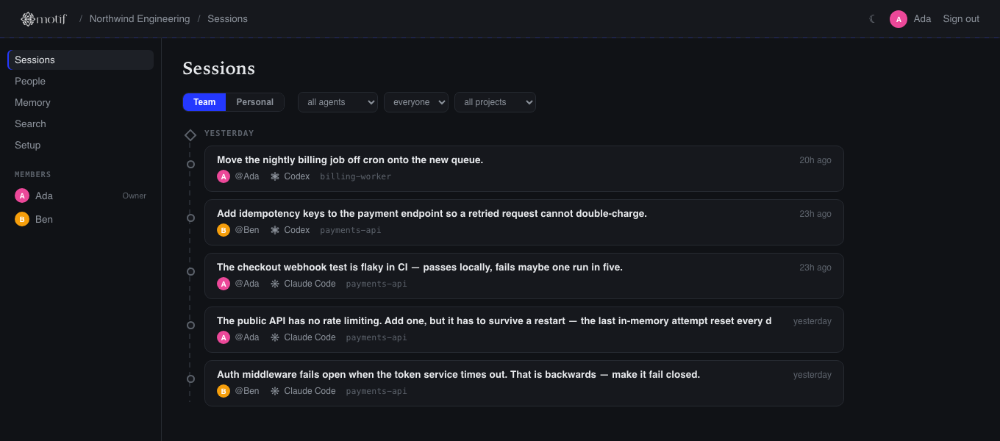
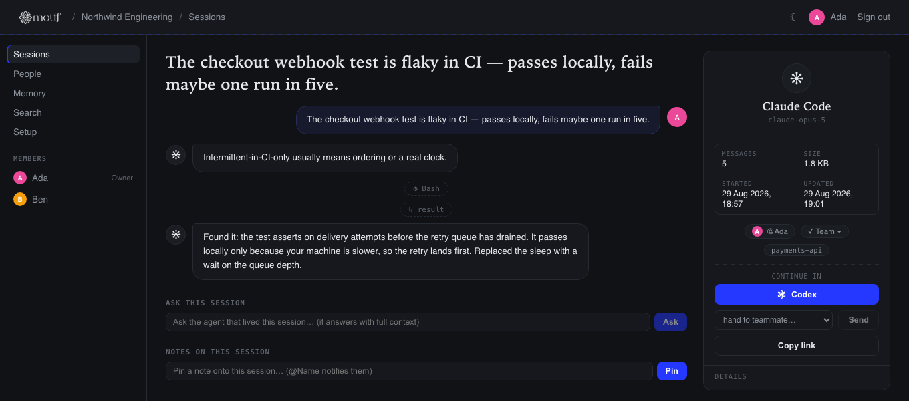

# Motif

**A unification layer for AI coding agent sessions.** Open source, fully self-hosted.

<p align="center">
  
</p>

<p align="center"><i>Start in Claude Code, finish in Codex — the session comes with you, natively.</i></p>

Your team writes code with Claude Code, Codex, and Cursor — each tool keeps its sessions
in its own format, in its own corner. Motif collects them in one place, makes them
searchable across tools and teammates, streams them live to a team dashboard, and can
hand a session started in one tool over to another tool **natively** — the target tool
treats it as its own history, not a summary.

## Features (v1)

- **Collect** — a lightweight daemon watches **Claude Code, Codex, and Cursor**
  sessions on each dev machine and syncs them live to your self-hosted server.
  Sessions never leave your infrastructure. (Other open-source agent CLIs are on
  the roadmap; open-weight models themselves — Hermes, Qwen, Llama via Ollama/OpenRouter — already work today
  as the memory engine through the `openai-compatible` provider.)
- **Native handoff** — convert a Claude Code session into a real Codex rollout file.
  `codex resume` picks it up as its own session; continue exactly where you left off.
- **Recall** — an MCP server that hands your agents the 1-2k tokens that matter
  instead of letting them re-derive the codebase every session. Deterministic
  (FTS + session graph + human notes), so it needs no API key.
- **Ask a session** — resume any past session read-only on the machine that owns
  it and get an answer from the agent that lived it, not a summary.
- **Session memory** — the server distills sessions into entity-based notes (files,
  decisions, topics) with supersession and conflict detection, powered by a pluggable
  LLM provider (Anthropic, OpenAI, any OpenAI-compatible endpoint, or the local
  `claude` CLI).
- **Solo mode** — `motif up` runs the same server locally. No team required.

<p align="center">
  
</p>

<p align="center"><i>Every teammate's sessions, from every tool, on one timeline.</i></p>

Open one and you get the conversation as it happened, what it touched, and the
one button that matters — continue it somewhere else, or hand it to someone:

<p align="center">
  
</p>

## Your agents can query it

Motif's real audience is not the dashboard — it is the agents themselves. One
command registers Motif as an MCP server with Claude Code, Codex and Cursor:

```bash
motif mcp install
```

Now your agent can answer "why is this like this?" from the team's own history
instead of grepping, and it can talk to past sessions:

| tool | what it does |
|---|---|
| `recall` | the distilled answer — past decisions, human notes, cited excerpts, in ~1.5k tokens |
| `search_sessions` / `list_sessions` | find the session |
| `get_session` | read a transcript |
| `ask_session` | **ask a past session a question** — the agent that lived it answers, with full context |

Same thing from your shell:

```bash
motif recall "why did we drop the network mount"
motif ask <session-id> "what was left to do here?"
```

### Does it actually save tokens?

Retrieval is measured, not asserted. `npm run bench` runs a set of questions
against your own corpus and reports whether the answer was in the bundle and
how big the bundle was:

```
Corpus: 1,774,659 tokens of session history · budget 1500 tokens/answer
hit rate 8/9 (89%) · median 1,496 tokens per answer · 1,186× smaller than the history it draws from
```

That is a *retrieval* benchmark over a real 1.8M-token corpus. The miss is
cross-language — the question was asked in one language about a decision
discussed in another, and lexical search is language-bound; distilled memory
covers that gap. Write your own `bench/questions.json` and reproduce it on
your corpus.

**No API key, no embeddings, no vector store.** Ranking comes from FTS/bm25 over
message text, the session graph (handoff lineage, shared memory entities,
overlapping files) and human curation — every item in a bundle says why it was
picked.

## Quick start

**Solo (one machine):**

```bash
npm i -g motifhq      # the binary is `motif`
motif up              # server + live sync on localhost:4680
motif ui              # open the dashboard
```

**Team (self-hosted server):**

```bash
# On your server (or: docker compose up)
npx motifhq server --port 4680
# → prints the team token

# On each dev machine
npx motifhq connect http://your-server:4680 --token <token> --name "Ada" --email ada@team.dev
motif daemon start    # sessions now stream to the server live
```

**Everyday commands:**

```bash
motif list                        # sessions across the whole team, newest first
motif search "rclone"             # full-text search over everyone's sessions
motif show <id>                   # read any session as a transcript
motif handoff <id> --open         # continue a Claude Code session in Codex, natively
motif handoff <id> --to-member "Ada"   # hand it to a teammate — lands in THEIR Codex
motif recall "how does auth work"      # what the team already knows (agents get this over MCP)
motif ask <id> "why did we do it this way?"   # the session answers, with its full context
motif mcp install                 # register Motif with Claude Code / Codex / Cursor
motif status / motif doctor       # health at a glance / diagnose with fixes
motif daemon install              # start the daemon at every login
motif skills                      # teach your agents to query the team memory
```

## Session memory

Set an LLM provider on the server and Motif distills idle sessions into
entity-based notes — decisions, files, topics — where new knowledge supersedes
old (history kept) and contradictions are flagged instead of silently piling up:

```bash
MOTIF_LLM_PROVIDER=anthropic MOTIF_LLM_API_KEY=sk-... motif server
# or: openai | openai-compatible (any baseURL: Ollama, vLLM, OpenRouter) | claude-code (local CLI, no key)
```

## Security model

Two credentials, two levels:

- **Team token** — shared once when the server first starts. Grants *read*
  access (dashboard, search) and lets a new teammate register. It can never
  write sessions or trigger actions: there is no identity to attribute.
- **Member token** — minted per person/device by `motif connect`, stored in
  `~/.motif/config.json` (only a hash lives on the server). Every write is
  attributed to the token's owner; a claimed name or header changes nothing,
  so members cannot impersonate each other.

Joining a team never auto-shares your history: a freshly connected machine
uploads everything as **personal** (visible only to you) until you mark
projects team-visible with `motif projects team <path>` or promote a session
from the dashboard. Team-visible sessions are readable by the whole team —
that is the product. Nobody can *write as* someone else, and handoffs and
asks only ever execute on the owning machine, via its own daemon.

**Privacy controls, applied before anything leaves a machine:** `exclude`
globs keep whole projects local; `redactPatterns` regexes scrub message text
*and* tool inputs. Put TLS in front with your reverse proxy (a two-line Caddy
config) for teams outside a trusted network.

## Running it for a team, 24/7

One server per team, one daemon per dev machine:

```bash
# Company server (survives restarts; SQLite lives in the volume)
docker compose up -d
# or without Docker:  MOTIF_TOKEN=<fixed-token> npx motifhq server

# Each developer, once:
npx motifhq connect https://motif.internal.yourco.dev --token <team-token> --name "Ada" --email ada@yourco.dev
motif daemon start        # logs: ~/.motif/daemon.log (auto-rotated)
```

**Who runs what:** exactly one person runs the server (on a company box or
their own machine); everyone else only runs `connect` once and keeps the
daemon on. Nobody's data leaves the team's own infrastructure.

**Footprint** (measured on a real workload — 130 sessions, ~10k messages):
steady-state RSS ≈ 57 MB for server+daemon combined, SQLite file ≈ 14 MB,
initial import of a large Cursor history ≈ 9 s. The daemon is fs-event
driven with a 60 s sweep; idle CPU is effectively zero. Health check for
monitoring: `GET /api/health`.

**Privacy on shared machines:** connect with `--selected` to start in
allowlist mode — nothing syncs until you `motif projects include <path>`.
See [SECURITY.md](SECURITY.md) for the full model.

To start the daemon at login, add a user LaunchAgent (macOS) or systemd user
unit (Linux) that runs `motif sync --watch`; example units live in `docs/`.

**Backups & retention:** everything lives in one SQLite file
(`~/.motif/motif.db`, or the `/data` volume under Docker). Copy that file on
a schedule, or point [Litestream](https://litestream.io) at it for continuous
replication. Keep the database lean with `motif prune --older-than 90` —
old raw sessions go, distilled memory notes stay.

## Try it without touching your own history

```bash
git clone https://github.com/motifhq/motif && cd motif
npm install && npm run build
bash scripts/demo.sh        # two members, invented sessions, a live dashboard
```

The demo pins every reader at its own scratch directories, so it never reads
`~/.claude`, `~/.codex` or your Cursor storage. `bash scripts/demo.sh clean`
removes it.

## Status

v1. Readers for Claude Code, Codex and Cursor are live; native handoff runs in
both directions (Claude Code ⇄ Codex) and is verified against Codex 0.150.1 —
the handoff writes a real rollout file and registers the thread in Codex's
state DB, so `codex resume` lists it and appends to it as its own history.
Recall, the MCP server and ask-a-session are in. 62 tests, CI on Linux,
macOS and Windows.

## License

Apache-2.0 — see [LICENSE](LICENSE).

Everything in this repository is Apache-2.0 and stays that way. Organisation
features (SSO enforcement, SCIM, audit and retention policy) will live in
[`ee/`](ee/) under a separate commercial licence; nothing that is free today
will move there. See [ee/README.md](ee/README.md).
